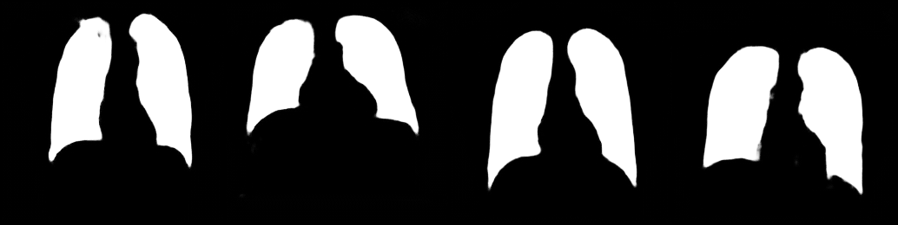
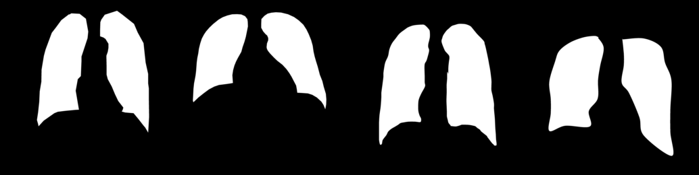
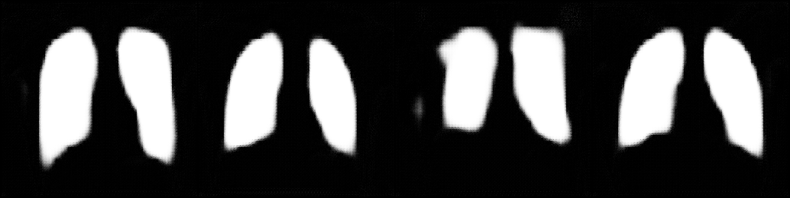
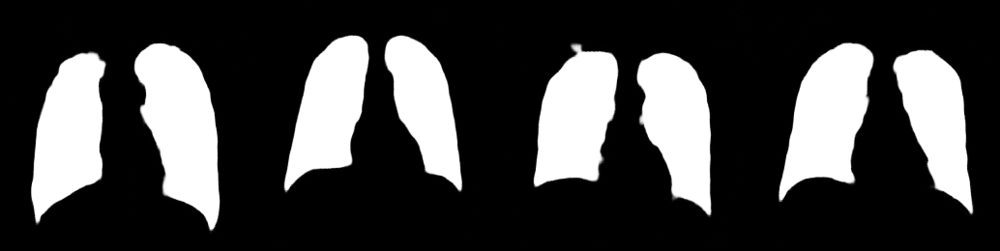

# X-Ray Segmentation using Pix2Pix

This repository contains my work on the [Kaggle Dataset](https://www.kaggle.com/nikhilpandey360/chest-xray-masks-and-labels), specifically on the task of segmenting out the lungs from X-Rays. I used the Pix2Pix architecture by treating this as an Image to Image translation where the lung images are our images from domain A and the masks from domain B. The model tries to learn a mapping function from domain A to B. This project worked as a way for me to know more about Segmentation and implementing a Pix2Pix model by myself.

## Results

## Intermediate images

